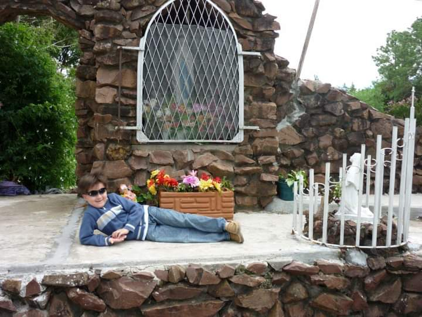

# BIBLIOTECA
  Para poder ejecutar la biblioteca con éxito deberá seguir los próximos 3 pasos.
## 1. Crear la base de datos "*BIBLIOTECA*" en cualquier lenguaje sql
 Por ejemplo:
 
 mysql
 ```mysql
 CREATE DATABASE BIBLIOTECA;
 ```

## 2. Instalar las dependencias del código utilizando ["dep.txt"](https://github.com/Database-I-project/Biblioteca/blob/main/dep.txt)
  Para instalar las dependencias debe descargar el archivo ["*dep.txt*"](https://github.com/Database-I-project/Biblioteca/blob/main/dep.txt) y luego instalarlas desde una consola:
  
  ```powershell
  pip install -r dep.txt
  ```

## 3. Cambiar las variables globales en el programa:
  Dentro del programa en las primeras líneas se puede visualizar 5 variables globales que se utilizan para la conexión a la base de datos sql:

```python
host='localhost'
port=3306
user='root'
database='biblioteca'
password=''
```

Si no tiene una contraseña asignada mantenga ese campo vacío.


Y listo! Ya tiene todo preparado para que su gestor de biblioteca funcione correctamente.
Estamos atentos a cualquier reporte de bugs o errores en el código. Puede enviar su reporte a [santiagord32@gmail.com](mailto:santiagord32@gmail.com)

### DEVELOPERS:

Santiago Ruiz Diaz AKA Santutu


